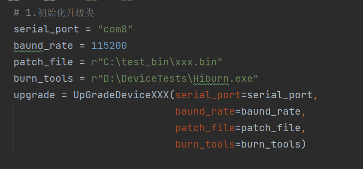
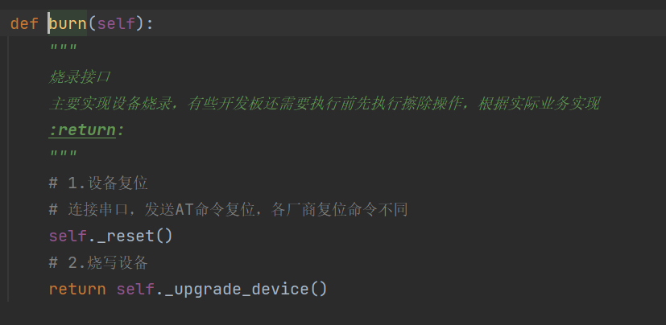
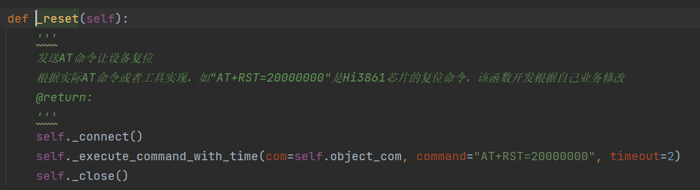
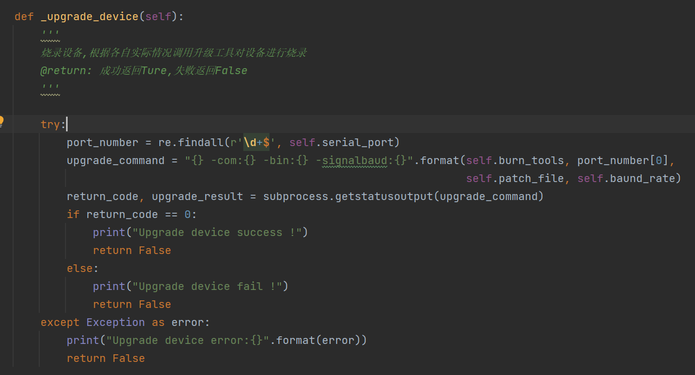
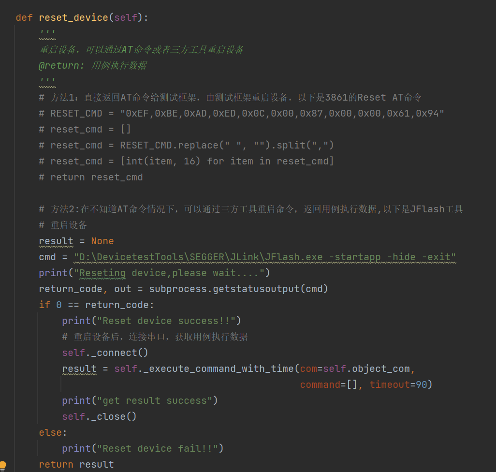
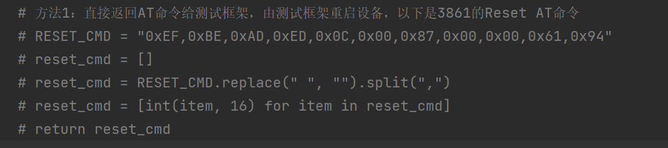
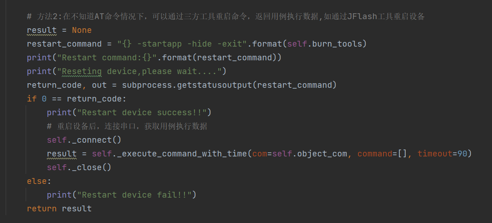

背景 & 现状：

目前Hi3861使用Hiburn.exe工具对设备进行烧录，烧录完成后重启设备自动执行测试用例，xDevice测试框架将收集测试用例执行数据，将其数据处理、结果解析，生成测试报告。但由于各厂商L0板子与Hi3861烧录方式不尽相同，为了兼容不同厂商也能在xDevice测试框架上执行，测试框架提供了支持调用厂商升级脚本对设备实现烧写和用例执行。

前提：

1. 串口可以实现AT命令（借助其它工具）重启和复位；
2. 刷机工具支持命令自动刷机；

以下是Hiburn和升级脚本两种烧录方式，请自行选择合适的烧录方式：

- Hiburn工具烧录(命令行烧写)

命令行烧录和用例执行步骤：

1. 设备复位

​		AT+RST=20000000 -》复位设备，等待20s在复位，否则复位不成功

2. send file 

​		发送bin文件到设备，在Window环境下，Hiburn.exe支持以命令行的方式调用，调用命令如下：

```shell
Hiburn.exe params
```

​		命令之间用空格隔开，如果命令带有参数，命令和参数之间作用冒号隔开，示例如下：

```
Hiburn.exe  -com:20 -bin:C:\test_bin\xxx.bin -signalbaud:115200
```

Hiburn.exe烧写命令参数

| 命令         | 参数               | 说明                                             |
| ------------ |------------------|------------------------------------------------|
| -com         | x                | PC端的串口号（例如1）                                   |
| -bin         | path\upgrade.bin | 固件包upgrade.bin的绝对路径，固件包的名称和文件类型根据各产品实际情况可能有所不同 |
| - signalbaud | 115200           | RomBoot下传输固件包时的串口波特率，默认为 115200bit/s           |

3. 重启设备

​		与串口建立连接后发送[239, 190, 173, 222, 12, 0, 135, 120, 0, 0, 97, 148]重启设备，然后开始自动执行用例，将执行数据返回给测试框架。

​		Command – Reset对应的AT命令如下

```shell
['0xef', '0xbe', '0xad', '0xde', '0xc', '0x0', '0x87','0x78', '0x0', '0x0', '0x61', '0x94']
```

​		备注：如果开发板支持Hiburn方式烧录，不需要提供升级脚本。

- 升级脚本烧写

1.  初始化升级类

​		建议：文件名和类名以名字后缀区分不同厂商,如UpGradeDeviceHuawei

​		初始化升级类，如UpGradeDeviceXXX

​		输入：串口号、波特率、执行文件bin路径、烧录工具名称、其它参数等

​		如下图：



2. 调用方法burn实现烧写

​		该函数主要是对设备进行复位、擦除、烧写设备，烧写成功返回True，失败返回False



​			1) 函数_reset()

​				发送命令让设备复位

​				

​		2)  函数_upgrade_device() 

​			对设备进行烧录



3. 调用方法reset_device重启设备

​		该函数主要是重启设备，然后自动执行用例，返回用例执行数据给测试框架。



​      1 ) 返回重启设备的AT命令，由xDevice框架做重启设备的操作



​    2)  在不知道AT命令情况下，借助三方工具重启设备，将执行用例的数据返回给xDevice做处理




 升级脚本Demo

```
import time
import serial
import re
import subprocess

PATTERN = re.compile(r'\x1B(\[([0-9]{1,2}(;[0-9]{1,2})*)?m)*')
# 测试套结束标签
CTEST_END_SIGN = "All the test suites finished"


class UpGradeDeviceXXX:
    """
    升级类，类名使用大写字母开头的单词(CapWords)风格命令，其中XXX表示芯片型号或者厂商：如UpGradeDeviceHi3861
    """

    def __init__(self, serial_port, baund_rate, patch_file, burn_tools, **kwargs):
        self.serial_port = serial_port
        self.baund_rate = baund_rate
        self.patch_file = patch_file
        self.burn_tools = burn_tools
        self.object_com = None
        self.is_open = None
        self.arg = kwargs

    def _connect(self):
        '''
        连接串口
        @return:
        '''
        try:
            if not self.is_open:
                self.object_com = serial.Serial(self.serial_port, baudrate=self.baund_rate, timeout=1)
                self.is_open = True
        except Exception as error_msg:
            error = "connect {} serial failed,please make sure this port is not occupied,error is {}".format(
                self.serial_port, str(error_msg))
            raise (error)

    def _close(self):
        '''
        关闭串口
        @return:
        '''
        try:
            if not self.object_com:
                return
            if self.is_open:
                self.object_com.close()
            self.is_open = False
        except (ConnectionError, Exception) as _:
            error_message = "Local device is disconnected abnormally"
            raise (error_message)

    def _execute_command_with_time(self, com, command, timeout):
        '''
        执行命令行函数
        @param com:
        @param command:
        @param timeout:
        @return:
        '''
        if isinstance(command, str):
            command = command.encode("gbk")
            if command[-2:] != b"\r\n":
                command = command.rstrip() + b'\r\n'
                com.write(command)
        else:
            com.write(command)
        return self._read_local_output(com=com, command=command,
                                       timeout=timeout)

    def _read_local_output(self, com=None, command=None, timeout=None):
        '''
        通过串口方式读取设备数据
        @param com:串口
        @param command:执行命令
        @param timeout:函数超时时间
        @return:
        '''
        result = None
        input_command = command
        start = time.time()
        while True:
            data = com.readline().decode('gbk', errors="ignore")
            data = PATTERN.sub("", data)
            if isinstance(input_command, list):
                if len(data.strip()) > 0:
                    # 测试日志添加时间戳
                    data = "{} {}".format(self._get_current_time(), data)
                    result = "{}{}".format(result, data.replace("\r", ""))
                    if re.search(r"\d+\s+Tests\s+\d+\s+Failures\s+\d+\s+Ignored", data):
                        start = time.time()
                    if CTEST_END_SIGN in data:
                        break
                if (int(time.time() - int(start))) > timeout:
                    return result
            else:
                result = "{}{}".format(result, data.replace("\r", "").replace("\n", "").strip())
                if (int(time.time() - int(start))) > timeout:
                    return result

        print("result:{}".format(result))
        return result

    def _reset(self):
        '''
        发送AT命令让设备复位
        根据实际AT命令或者工具实现，如"AT+RST=20000000"是Hi3861芯片的复位命令，该函数开发根据自己业务修改
        @return:
        '''
        self._connect()
        self._execute_command_with_time(com=self.object_com, command="AT+RST=20000000", timeout=2)
        self._close()

    def _upgrade_device(self):
        '''
        烧录设备,根据各自实际情况调用升级工具对设备进行烧录
        @return: 成功返回Ture,失败返回False
        '''

        try:
            port_number = re.findall(r'\d+$', self.serial_port)
            upgrade_command = "{} -com:{} -bin:{} -signalbaud:{}".format(self.burn_tools, port_number[0],
                                                                         self.patch_file, self.baund_rate)
            return_code, upgrade_result = subprocess.getstatusoutput(upgrade_command)
            if return_code == 0:
                print("Upgrade device success !")
                return False
            else:
                print("Upgrade device fail !")
                return False
        except Exception as error:
            print("Upgrade device error:{}".format(error))
            return False

    def restart_device(self):
        '''
        重启设备，可以通过AT命令或者三方工具重启设备
        @return: 用例执行数据
        '''
        # 方法1：直接返回AT命令给测试框架，由测试框架重启设备，以下是3861的Reset AT命令
        # RESET_CMD = "0xEF,0xBE,0xAD,0xED,0x0C,0x00,0x87,0x00,0x00,0x61,0x94"
        # reset_cmd = []
        # reset_cmd = RESET_CMD.replace(" ", "").split(",")
        # reset_cmd = [int(item, 16) for item in reset_cmd]
        # return reset_cmd

        # 方法2:在不知道AT命令情况下，可以通过三方工具重启命令，返回用例执行数据,如通过JFlash工具重启设备
        result = None
        restart_command = "{} -startapp -hide -exit".format(self.burn_tools)
        print("Restart command:{}".format(restart_command))
        print("Reseting device,please wait....")
        return_code, out = subprocess.getstatusoutput(restart_command)
        if 0 == return_code:
            print("Restart device success!!")
            # 重启设备后，连接串口，获取用例执行数据
            self._connect()
            result = self._execute_command_with_time(com=self.object_com, command=[], timeout=90)
            self._close()
        else:
            print("Restart device fail!!")
        return result

    def burn(self):
        """
        烧录接口
        主要实现设备烧录，有些开发板还需要执行前先执行擦除操作，根据实际业务实现
        :return:
        """
        # 1.设备复位
        # 连接串口，发送AT命令复位，各厂商复位命令不同
        self._reset()
        # 2.烧写设备
        return self._upgrade_device()

    def _get_current_time(self):
        """
        获取当前时间戳
        :return:
        """
        current_time = time.time()
        local_time = time.localtime(current_time)
        data_head = time.strftime("%Y-%m-%d %H:%M:%S", local_time)
        millisecond = (current_time - int(current_time)) * 1000
        return "%s.%03d" % (data_head, millisecond)


if __name__ == '__main__':
    # 1.初始化升级类
    serial_port = "com8"
    baund_rate = 115200
    patch_file = r"C:\test_bin\xxx.bin"
    burn_tools = r"D:\DeviceTests\Hiburn.exe"
    upgrade = UpGradeDeviceXXX(serial_port=serial_port,
                               baund_rate=baund_rate,
                               patch_file=patch_file,
                               burn_tools=burn_tools)

    # 2.烧写设备
    result = upgrade.burn()

    # 3.重启设备
    result_data = upgrade.restart_device()
    print("result_data:{}".format(result_data))

```

